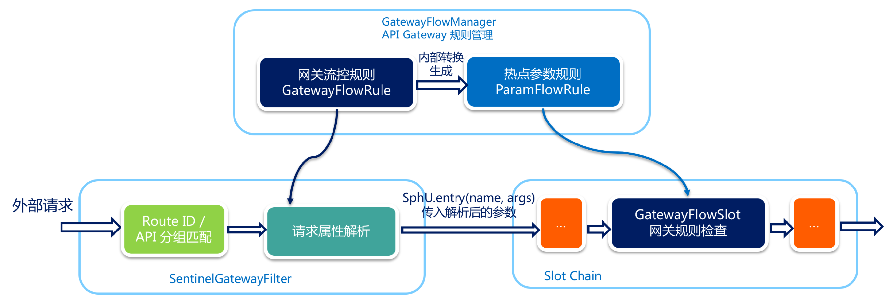

###基于 Sentinel 实现服务容错

        引用Sentinel 官方文档 —— 网关限流   
        https://github.com/alibaba/Sentinel/wiki/%E7%BD%91%E5%85%B3%E9%99%90%E6%B5%81
        
        实现步骤:
           1\启动sentinel服务端控制台
           java -Dserver.port=9090 -Dcsp.sentinel.dashboard.server=192.168.66.9:9090 -Dproject.name=sentinel-dashboard -Dcsp.sentinel.app.type=1 -jar $SENTINEL_PATH/sentinel-dashboard-1.8.2.jar
           2\SpringBoot启动类
            @SpringBootApplication
            public class GatewaySentinelDemoApplication {
                public static void main(String[] args) {
                  System.setProperty(SentinelConfig.APP_TYPE_PROP_KEY, "1"); // 【重点】设置应用类型为 Spring Cloud Gateway
                  SpringApplication.run(GatewaySentinelDemoApplication.class, args);
                }
            }
            3\配置文件参考项目源码
            4\网关限流
            5\API定义分组

#####网关流控实现原理
            当通过 GatewayRuleManager 加载网关流控规则（GatewayFlowRule）时，
            无论是否针对请求属性进行限流，Sentinel 底层都会将网关流控规则转化为热点参数规则（ParamFlowRule），存储在 GatewayRuleManager 中，
            与正常的热点参数规则相隔离。转换时 Sentinel 会根据请求属性配置，为网关流控规则设置参数索引（idx），
            并同步到生成的热点参数规则中。
            外部请求进入 API Gateway 时会经过 Sentinel 实现的 filter，其中会依次进行 路由/API 分组匹配、请求属性解析和参数组装。
            Sentinel 会根据配置的网关流控规则来解析请求属性，并依照参数索引顺序组装参数数组，
            最终传入 SphU.entry(res, args) 中。Sentinel API Gateway Adapter Common 模块向 
            Slot Chain 中添加了一个 GatewayFlowSlot，专门用来做网关规则的检查。
            GatewayFlowSlot 会从 GatewayRuleManager 中提取生成的热点参数规则，
            根据传入的参数依次进行规则检查。若某条规则不针对请求属性，则会在参数最后一个位置置入预设的常量，
            达到普通流控的效果。
        
