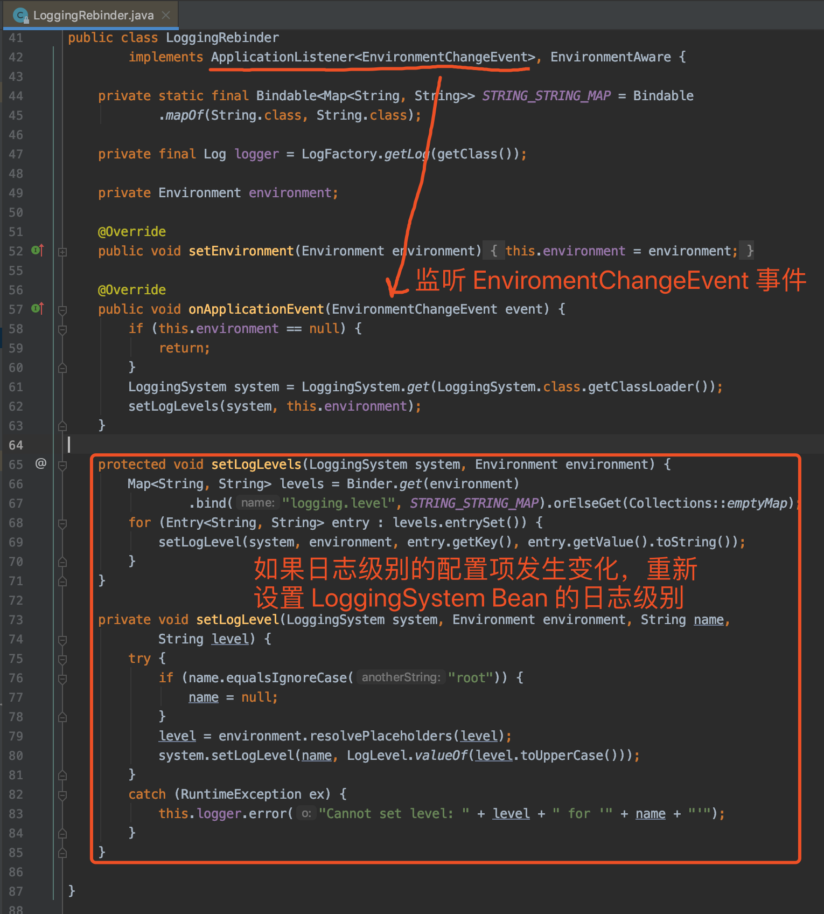

###多环境配置
     IDEA 中，启动控制台增加 -Dspring.profiles.active=dev 到 VM options 中
     java -Dspring.profiles.active=test -jar example-0.0.1-SNAPSHOT.jar
     java -Dspring.cloud.nacos.config.group=DEV_GROUP -jar example-0.0.1-SNAPSHOT.jar
    
     用 Data ID 区分环境;用Group区分;用Namespace区分环境，清晰明了，而且有利于做权限控制
###自动刷新配置
    在应用已经启动的情况下，如果我们将读取的 Nacos 的配置进行修改时，应用是否会自动刷新本地的配置呢？
    答案:使用 @ConfigurationProperties 注解的会，单使用 @Value 注解的不会。
        @Value+@RefreshScope组合使用会进行自动刷新
###自定义实现对配置的监听(数据库连接的变更、日志级别的变更等)
####自定义监听日志级别的配置

        @Component
        public class DemoEnvironmentChangeListener implements ApplicationListener<EnvironmentChangeEvent> {
        
            private Logger logger = LoggerFactory.getLogger(getClass());
        
            @Autowired
            private ConfigurableEnvironment environment;
        
            @Override
            public void onApplicationEvent(EnvironmentChangeEvent event) {
                for (String key : event.getKeys()) {
                    logger.info("[onApplicationEvent][key({}) 最新 value 为 {}]", key, environment.getProperty(key));
                }
            }
        
        }
#####SpringCloud 运行时刷新数据源相关配置
        数据库的相关配置，一般来说是不会频繁变的，特别是当数据库连接使用的是域名而不是ip地址的时候，这样即使ip地址变化了，也不影响业务系统。这里呢，我们讲一下如果真的是迫不得已的时候，有没有不重启就可以更改配置的方法。
        思路
        有很多种方案，这里我们讲一下基于SpringCloud的RefreshScope的方案。
        
        数据库配置实例
        spring:
        datasource:
        platform: postgres
        url: jdbc:postgresql://192.168.99.100:5432/postgres
        driverClassName: org.postgresql.Driver
        username: postgres
        password: 123456
        validation-query: SELECT 1
        test-while-idle: true
        test-on-borrow: true
        Java配置
        @Configuration
        public class DbConfig {
        
            @Bean
            @RefreshScope //refresh
            @Primary
            @ConfigurationProperties(prefix = "spring.datasource")
            public DataSource dataSource() {
                return DataSourceBuilder.create().build();
            }
        }
        更新
        调用一下服务的refresh端点就可以了
        
        curl -i -X POST http://localhost:9001/refresh
        验证
        @Component
        public class ScheduleTask {
        
            @Autowired
            UserRepository userRepository;
        
            @Scheduled(fixedDelay = 5*1000 /**ms**/,initialDelay = 5*1000)
            public void testDataSourceConn() {
                try{
                    System.out.println("call jdbc");
                    userRepository.findAll();
                }catch (Exception e){
                    e.printStackTrace();
                }
            }
        }
        这里跑一个定时任务，不停地调用数据查询方法，然后中途改下密码，然后refresh一下，看是否报错
####配置加载顺序
        Nacos Config 提供了三种配置 Nacos 配置集的方式：
        
        A：通过 spring.cloud.nacos.config.shared-configs 配置项，支持多个共享 Nacos 配置集。
        B：通过 spring.cloud.nacos.config.extension-configs 配置项，支持多个拓展 Nacos 配置集。
        C：通过 spring.cloud.nacos.config.name 配置项，支持一个 Nacos 配置集。

        shared-configs:
          - data-id: common-test.yaml #必须带后缀
            group: COMMON_GROUP
            refresh: true