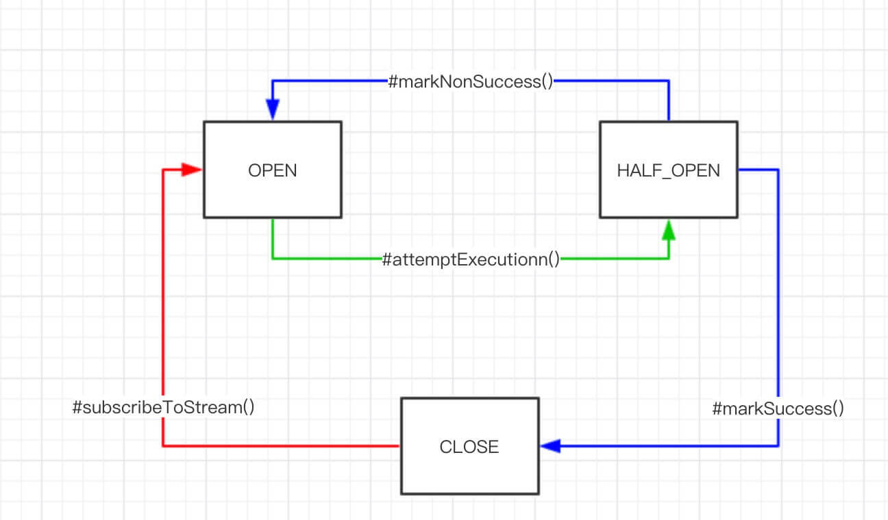
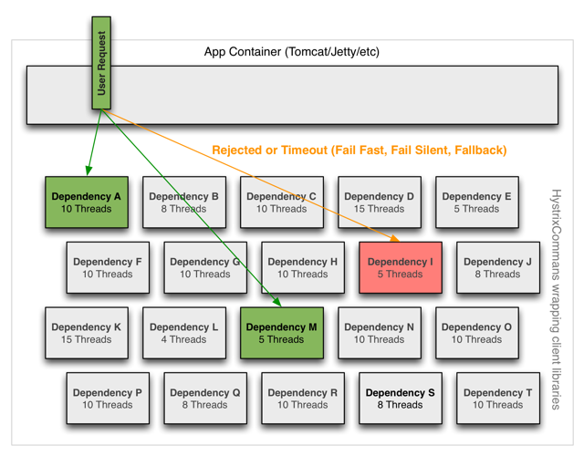

### 服务雪崩
     在绝大多数情况下，服务消费者都能正常的远程调用服务提供者。但是某一时刻，服务提供者执行逻辑较慢，又或者网络出现抖动的情况，
     导致服务消费调用服务提供者超时或者失败。
     如果这个情况持续一段时间，服务提供者的响应一直很慢，导致服务消费者的响应也跟着很慢，最终引起服务消费者的请求任务积压，
     也跟着一起出问题了。
     友情提示：以 SpringMVC 提供 API 接口举例子，因为 Tomcat 的线程池是有限的，如果个别请求处理很慢，会逐步占用到整个线程池，
     导致后续其它请求无法被处理。
     因为一个下游服务的故障，导致上游服务一起跟着故障的现象，我们称为“服务雪崩”
###针对“服务雪崩”的情况，我们需要进行“服务容错”处理
         一般常用的手段有，主要是限流和开关。
        ① 限流
        通过限制调用服务的频率，避免频繁调用故障服务，导致请求任务积压而自身雪崩。
        ② 开关
        通过关闭对故障服务的调用，停止调用故障服务，从而避免服务雪崩。当然，关闭的前提是，不调用故障服务的情况下，
        业务逻辑依然可以走下去，或者业务数据的完整性不会被破坏。

###Hystrix 比较重要的是三个特性：1）Fallback 服务降级；2）断路器机制；3）资源隔离。
####服务降级
    在服务调用失败时，我们可以通过 Hystrix 实现 Fallback 服务降级。
    详见源码DemoController   注解@HystrixCommand(fallbackMethod = "getUserFallback")
####断路器机制
    HystrixCircuitBreaker 状态变迁如下图 

    ① 红线 ：初始时，断路器处于 CLOSED 状态，链路处于健康状态。当满足如下条件，断路器从 CLOSED 变成 OPEN 状态：
    周期( 可配，HystrixCommandProperties.default_metricsRollingStatisticalWindow = 10000 ms )内，
    总请求数超过一定量( 可配，HystrixCommandProperties.circuitBreakerRequestVolumeThreshold = 20 ) 。
    错误请求占总请求数超过一定比例( 可配，HystrixCommandProperties.circuitBreakerErrorThresholdPercentage = 50% ) 。
    ② 绿线 ：断路器处于 OPEN 状态，命令执行时，若当前时间超过断路器开启时间一定时间( HystrixCommandProperties.circuitBreakerSleepWindowInMilliseconds = 5000 ms )，
    断路器变成 HALF_OPEN 状态，尝试调用正常逻辑，根据执行是否成功，打开或关闭熔断器【蓝线】。
#### 资源隔离
    Hystrix 使用了“舱壁隔离模式”来隔离和限制各个请求，从而实现资源的隔离。

    Hystrix 通过线程池和信号量（Semaphore） 两种模式来实现隔离。
    ① 线程池模式
    默认情况下，Hystrix 采用线程池模式来实现隔离。
    针对调用的每一个服务，我们给其单独分配一个线程池。例如说，产品服务的调用分配在 A 线程池，用户服务的调用分配在 B 线程池。
    这样隔离后，两个服务的调用不会相互影响。
    ② 信号量模式
    使用线程池模式来隔离时，需要进行上下文的切换，带来一定的性能损耗。因此，如果对性能有较高要求，且能够接受信号量模式不支持超时的情况，
    可以考虑采用信号量模式。
###请求缓存
    Hystrix 支持在同一个 HystrixRequestContext 上下文中，提供缓存的功能，以提升高并发场景下的性能，
    同时也带来相同缓存键返回相同结果的特性。
    ① @CacheResult 注解，添加在方法上，声明将方法的执行结果进行缓存，并后续从缓存中获取结果。
    cacheKeyMethod 属性：设置缓存键的生成方法。
    另外，我们也可以使用 @CacheKey 注解，直接设置缓存键的字符串，它的优先级比 `@CacheResult.cacheKeyMethod` 属性高。
    
    ② @CacheRemove 注解，添加在方法上，声明移除指定 Hystrix Command 生成的缓存。
    commandKey 属性：设置 Hystrix Command 键。
    cacheKeyMethod 属性：设置缓存键的生成方法。

    详见源码CacheDemoService\HystrixRequestContextFilter\CacheDemoController
###请求合并
    Hystrix 支持在同一个 HystrixRequestContext 上下文中，提供请求合并的功能，将一段时间的相同类型的请求，
    延迟合并请求服务提供者的批量 API 接口，以减少请求次数，减少服务压力。

    通过 @HystrixCollapser 注解进行声明：
    collapserKey 属性：Hystrix 合并请求键，默认为方法名。
    batchMethod 属性：合并请求时，执行的方法名。Hystrix 的合并请求，并不能智能的知道调用的批量接口，所以需要手动编写调用方法。
    scope 属性：合并请求的范围，目前有 REQUEST 请求和 GLOBAL 全局两个级别。
    collapserProperties 属性：Hystrix 合并请求的拓展变量。一般我们可以通过 "timerDelayInMilliseconds" 变量，来设置延迟的时长。
    
    详见源码 CollapserDemoService、HystrixRequestContextFilter、CollapserDemoController