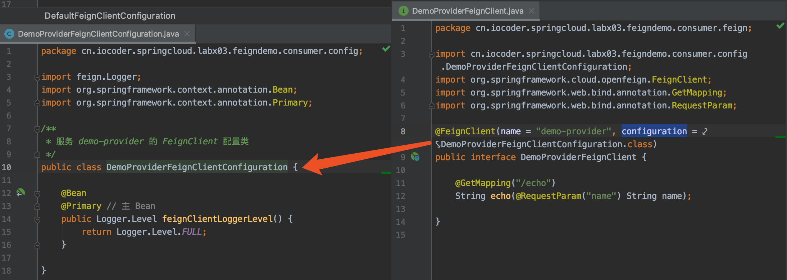
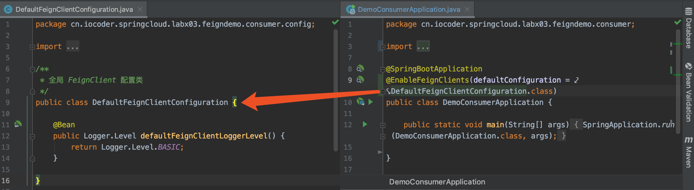

##配置文件方式
###fegin配置类FeignClientConfiguration
###fegin日志级别
    feign:
    # Feign 客户端配置，对应 FeignClientProperties 配置属性类
    client:
    # config 配置项是 Map 类型。key 为 Feign 客户端的名字，value 为 FeignClientConfiguration 对象
    config:
    # 全局级别配置
    default:
    logger-level: BASIC
    # 客户端级别配置
    demo-provider:
    logger-level: FULL

    在 Feign 中，定义了四种日志级别：
    NONE：不打印日志
    BASIC：只打印基本信息，包括请求方法、请求地址、响应状态码、请求时长
    HEADERS：在 BASIC 基础信息的基础之上，增加请求头、响应头
    FULL：打印完整信息，包括请求和响应的所有信息。

##Spring JavaConfig 方式进行配置

     创建 DefaultFeignClientConfiguration、DemoProviderFeignClientConfiguration 配置类，FeignClient 配置类。代码如下：

    // DefaultFeignClientConfiguration.java
    /**
    * 全局 FeignClient 配置类
      */
      public class DefaultFeignClientConfiguration {
    
      @Bean
      public Logger.Level defaultFeignClientLoggerLevel() {
      return Logger.Level.BASIC;
      }
    
    }
    
    // DemoProviderFeignClientConfiguration.java
    /**
    * 服务 demo-provider 的 FeignClient 配置类
      */
      public class DemoProviderFeignClientConfiguration {
    
      @Bean
      @Primary // 主 Bean
      public Logger.Level feignClientLoggerLevel() {
      return Logger.Level.FULL;
      }
    
    }

####客户端级别的自定义配置

####全局级别的自定义配置

    配置文件方式的优先级高于 Spring JavaConfig 方式，客户端级别的优先级高于全局级别

    fegin接口上传文件
    https://www.iocoder.cn/Fight/The-Spring-Cloud-Feign-interface-uploads-files/?self
    fegin接口  post表单请求
    https://www.iocoder.cn/Fight/Spring-Cloud-Feign-Post-form-request/?self

###Fegin客户端

    默认情况下，Feign 通过 JDK 自带的 HttpURLConnection 封装了 Client.Default，实现 HTTP 调用的客户端
    因为 HttpURLConnection 缺少对 HTTP 连接池的支持，所以性能较低，在并发到达一定量级后基本会出现。
    ApacheHttpClient，基于 Apache HttpClient 封装 详见openfegin-httpclient-demo模块项目
    OkHttpClient，基于 OkHttp 封装 详见openfegin-okhttpclient-demo模块项目

###Fegin请求重试
    Feign 和 Ribbon 都有请求重试的功能，两者都启用该功能的话，会产生冲突的问题。因此，有且只能启动一个的重试
    
    OpenFeign 中，默认创建的是 NEVER_RETRY 不进行重试
     @Configuration
    public class FeignConfigure {
    
        @Bean
        public Retryer feignRetryer(){
            // period=100 发起当前请求的时间间隔,单位毫秒
            // maxPeriod=1000 发起当前请求的最大时间间隔,单位毫秒
            // maxAttempts=2 重试次数是1，因为包括第一次，所以我们如果想要重试2次，就需要设置为3
            Retryer retryer = new Retryer.Default(100, 1000, 2);
            return retryer;
        }
    }

    推介使用ribbon的重试机制
    ribbon:
        ConnectTimeout: 1000 # 请求的连接超时时间，单位：毫秒。默认为 1000
        ReadTimeout: 1 # 请求的读取超时时间，单位：毫秒。默认为 1000
        OkToRetryOnAllOperations: true # 是否对所有操作都进行重试，默认为 false。
        MaxAutoRetries: 0 # 对当前服务的重试次数，默认为 0 次。
        MaxAutoRetriesNextServer: 1 # 重新选择服务实例的次数，默认为 1 次。注意，不包含第 1 次哈。

####Feign 与 RestTemplate 的对比
    从开发效率、可维护性的角度来说，Feign 更加有优势。
    从执行性能、灵活性的角度来说，RestTemplate 更加有优势。
    
    个人推荐使用 Feign 为主，RestTemplate 为辅：
    
    相比来说，开发效率、可维护性非常重要，要保证开发的体验。
    执行性能的问题，因为 Feign 多一层 JDK 动态代理，所以会差一些。
    不过 HTTP 调用的整体性能的大头在网络传输和服务端的执行时间，所以 Feign 和 RestTemplate 的性能差距可以相对忽略。
    灵活性的问题，99.99% 的情况下，Feign 都能够实现或者相对绕的实现；无法实现的情况下，在考虑采用 RestTemplate 进行实现。
